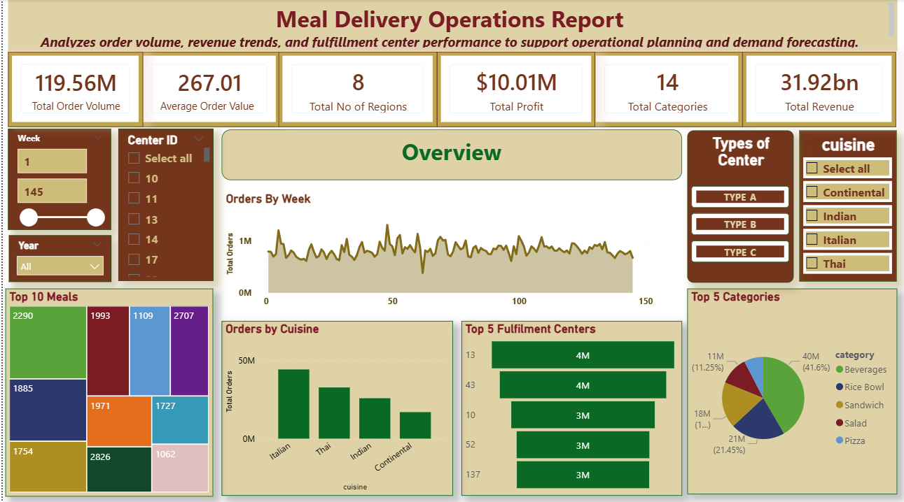
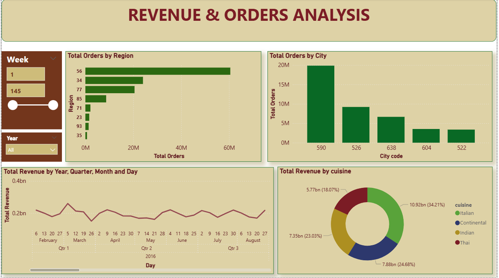
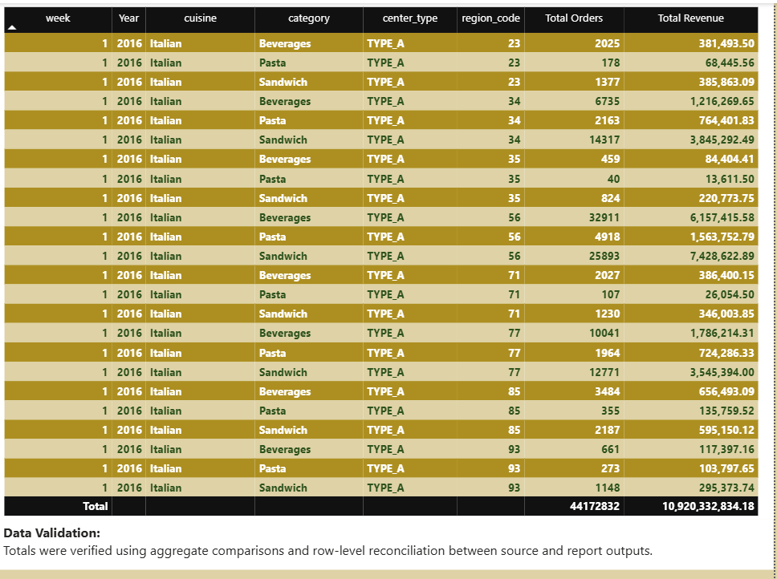
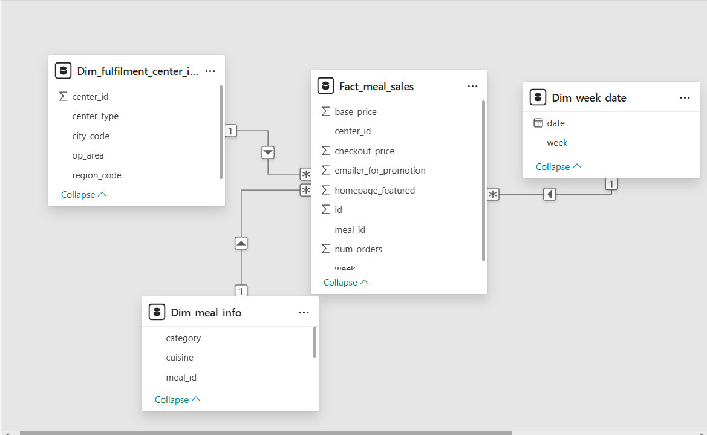

# Meal Delivery Operations Report

## Project Overview

This project analyzes meal delivery operations data to monitor order volume, revenue trends, and fulfillment center performance.
The report supports operational planning and performance monitoring through interactive dashboards.

---

## Business Objectives

* Monitor daily and monthly order volume
* Track revenue and cost trends
* Evaluate fulfillment center performance
* Identify operational patterns to support decision-making

---

## Tools Used

* Power BI
* Data Modeling
* DAX
* Data Visualization

---

## Key Metrics

* Total Orders
* Total Revenue
* Total Cost
* Profit
* Orders by Fulfillment Center
* Order Trends Over Time

---

## Report Pages

### Overview

Provides high-level KPIs and overall performance summary.

### Analysis

Shows trends in orders, revenue, and operational performance.

### Details

Displays granular data for deeper operational insights.

---

## Data Model

The dataset was transformed and modeled in Power BI to support reporting and analysis.

---

## Screenshots

### Overview Page

### Analysis Page

### Details Page

### Data Model Page

---

## Author

Suja
Power BI | SQL | Data Analysis
Open to Remote Opportunities
